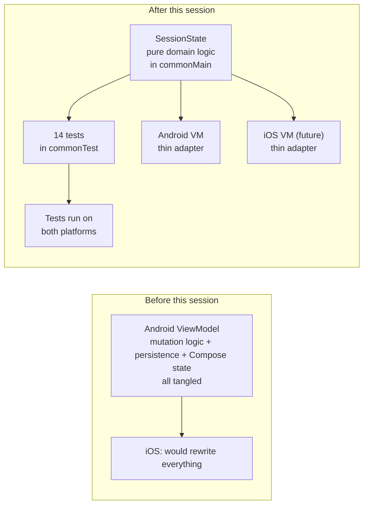

I spent this session making SessionClick genuinely ready for its second platform — without writing a single line of iOS code. That sounds backwards until you see what it actually meant: extracting the domain logic out of the Android-specific code it had been living in, and wrapping it in tests that now run on the iOS simulator automatically.

## Where the app is

SessionClick is a stage-focused metronome for gigging musicians. Android first (Kotlin Multiplatform, Compose UI), iOS planned as the next phase. At the start of this session the Android app already had:

- A solid audio engine (Oboe via JNI, ø 0.15 ms jitter at 120 BPM on my test device)
- Playlist and setlist editing — swipe, reorder, undo
- Multi-playlist support with auto-save to JSON

What it didn't have was any real shared core for iOS to plug into. Almost everything lived in `composeApp/androidMain/` — the module that Android code runs in, and that iOS code cannot touch.

## The feature sprint: Song pool

The session started with a feature, not a refactor. Until now, each playlist stored its own copy of every song inline. Two playlists that both contained "Autumn Leaves" at 112 BPM held two independent song records. Editing the tempo in one didn't change the other.

Claude proposed a classic pool model: store songs in one central list; have playlists hold lightweight references (`SongRef`) pointing to pool entries by ID. Same song in two playlists = one pool record, two refs. Claude drafted the architecture and the JSON migration for existing devices; I handed the prompts to Gemini Code Assist inside Android Studio, which implemented them; I tested on my phone.

Side effect: the data model became substantially cleaner. Specials (stage directions like "pause" or "speaker intro") stayed inline because they're one-offs with no reuse value. Only songs moved to the pool. The migration function runs silently on app startup for anyone who installed a previous version.

Then a full Song Library screen on top — search, multi-select, alphabetical sort. Replaced the quick picker I'd built earlier in the week. Multi-select adds N songs at once to the active playlist. That's a workflow a gigging musician will actually use.

## The detour: where the FAB shouldn't go

One subtle thing the session exposed: Claude and Gemini combined are very good at doing what you ask, and only what you ask. When I asked for a floating action button, both obliged. They produced a textbook Material 3 FAB in the standard bottom-right corner.

On device I immediately realized the bottom-right corner is exactly where my thumb already lives, because that's where the big Play/Stop button is. The FAB hovered right over it. A mis-tap mid-gig would be a real problem.

I told Claude to fix it. Claude put the "+" back in the TopAppBar with an animation that hides it during playback — safely out of the thumb zone. Then I realized the three options ("New Song", "Add from Library", "Special Entry") had moved from a dropdown menu to a bottom sheet, and I preferred the dropdown. We reverted that too.

Both of those changes came from me catching something only visible on a real device with real fingers. Neither Claude nor Gemini would have noticed. Claude saved both preferences to memory so next time I ask for an action button in this app, it won't propose a bottom-right FAB.

## The audit that shifted the plan

After the feature work landed, I asked Claude for a technical-state audit: Is the architecture future-proof? Is all the shared logic in the shared module? Are there tests?

Claude spawned a sub-agent (one of the useful tricks with larger workflows — it keeps the main conversation clean) to read every file and report back. The findings weren't surprising in retrospect, but they were sharper than I'd have articulated on my own:

- The audio engine abstraction was excellent. Clean interface in shared code, Android-specific JNI implementation behind it. iOS can drop in behind the same interface.
- The migration logic (v1 inline-songs → v2 pool + refs) was already in `shared/commonMain` and already tested.
- **But the main ViewModel — `SessionViewModel`, the class holding every playlist mutation, every selection rule, every piece of song management — lived entirely in `androidMain`, with 130+ lines of domain logic tangled up with Android's `AndroidViewModel`, `Context`, `java.util.UUID`, and `org.json`. None of it reusable for iOS.**
- Two tests existed: one real (migration), one a placeholder asserting 1+2=3.

Not a surprise. But seeing it laid out made the priority obvious: before any more features, extract the domain logic into shared code and wrap it in tests.

## Extracting SessionState

Claude designed a split: a pure `SessionState` class in `shared/commonMain` holding every mutation rule, with an `onChange` callback the Android ViewModel subscribes to. The ViewModel becomes a thin adapter — it generates UUIDs and timestamps (Android's prerogative), shadows the shared state's lists in Compose-observable form (Compose's prerogative), and delegates every actual domain operation to `SessionState`.

Gemini implemented it. I tested on device. Everything worked identically, but now 130 lines of domain logic were free of Android dependencies. Grep for `import android` in `shared/commonMain` returned nothing.

## The tests that already run on iOS

Then Claude wrote a prompt for a comprehensive test suite covering the tricky stuff:

- The `selectedIndex` arithmetic in `removeItem`, `moveItem`, `restoreItem` — four different cases where an off-by-one would make a user lose their place mid-song on stage
- The cascade delete: removing a song from the pool should remove every reference to it across every playlist
- The cross-playlist propagation: editing a song's BPM from playlist A should immediately affect playlist B
- Bulk operations firing `onChange` exactly once (for save performance)

Gemini wrote 14 tests. They all pass. And because `SessionState` lives in `commonTest`, **the tests automatically ran on the iOS simulator target too** — Gemini's output showed both targets in the Gradle log. I have iOS regression coverage for logic that has no iOS UI yet.

That's the KMP payoff made tangible. Every test I write in the shared module protects both platforms. It's genuinely one of the best reasons to use KMP for a solo project: the test investment is halved automatically.

## What's left

There's one more architecture step before iOS is truly ready: swap `org.json` (Android-only) for `kotlinx.serialization` (multiplatform), and introduce `expect`/`actual` declarations for file I/O. That'll move the last 50-odd lines of persistence into shared code. I deliberately deferred it to the next session — it changes Gradle dependencies and the JSON wire format, and mixing that with logic refactors is how subtle bugs slip in. The test suite I just wrote is the safety net that makes that next step low-risk.

After that, it's user-facing JSON export and import, and the freemium gate — both features that'll now be written once for both platforms instead of twice.

## What I actually did versus what the AI did

- I decided what to build, what order to build it in, and what "done" looked like
- Claude did the architecture thinking, wrote every prompt Gemini received, ran the audit via a sub-agent, designed the test coverage, and saved my specific preferences (no bottom-right FABs in this app, prefer dropdown menus over bottom sheets for top-bar triggers) to memory so they survive across sessions
- Gemini Code Assist, inside Android Studio, wrote essentially all the code — `SessionState`, `SessionSeed`, the test suite, every UI tweak
- I tested every change on my actual phone, caught the FAB placement problem and a stale-list bug in the Library, and made the judgment calls when Claude proposed options

The interesting thing this week isn't any single feature. It's that the AI collaboration has a shape now. Claude plans and reviews; Gemini implements; I decide and test. When Gemini quietly exceeded scope — it added a delete-from-library UI I didn't ask for, and it added a `bulk addItems` method I didn't request — I caught it in Claude's review step before it went to the device. When Claude missed a stage-usability issue, I caught it with my thumb. The layers cover each other's blind spots.

---

**Time spent today:** ~1h30min

---

_This blog documents my attempt to build and ship a music app as a solo developer, with AI assistance. The AI does a lot of the work. I try to be specific about what._
