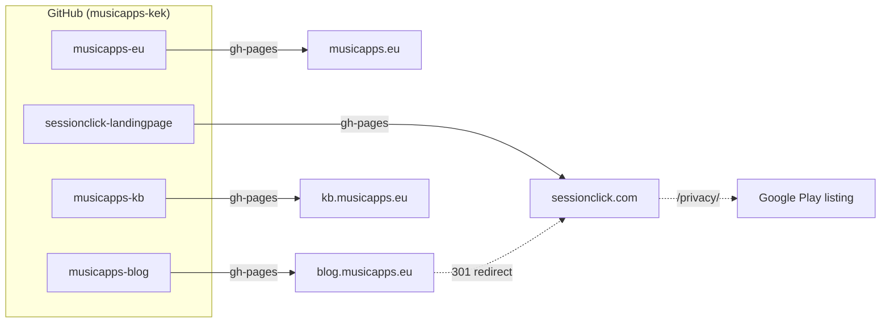

Two days ago the app was submitted for review. The Play Store listing links to a privacy policy, the planned Impressum needs a home, and testers need somewhere to land that isn't a blog post. Time to build the landing pages.

This post is a little different from the recent Android-focused ones: there's no Gemini, no Kotlin, no Compose. Two threads of work ran in parallel — the web plumbing, which Claude did almost all of, and the image preparation for the landing pages, which I did entirely by hand.

## Scope of the session

Four GitHub Pages sites, four custom domains, one shared DNS apex. That's the shape I went in with. The details were where the time went.

## The part I did entirely by hand: the screens

Before any scaffolding, I spent a reasonable chunk of time preparing the images that the landing page shows: the labeled player screenshot with arrows pointing at tempo, volume, and the beat indicator; the annotated setlist view explaining the gestures; the light/dark portrait/landscape composite; the Play Store banner.

This part was **fully manual** — SnagIt for the callouts, arrows, and labels, and some compositing on top. No AI in this step.

That's on purpose. I've experimented with AI image tools for product visuals a few times over the last months, and my honest observation is: AI is good at *advising* — suggesting layouts, proposing which callouts to include, critiquing contrast — but the actual pixel-pushing for marketing images is usually better done by hand. The moment an arrow has to land precisely on a UI element, or a screenshot needs to be cropped without chopping a shadow, the manual tools beat the generative ones. It's faster to do it right than to prompt-coax it into being right.

So the workflow here was: Claude and I talked about *what* each image should show; I made them; Claude wrote alt text based on actually reading the finished PNGs.

## sessionclick.com — the product page

**What I decided:** Hugo, not plain HTML. I wanted a build step so legal pages could be Markdown and layouts could be reused. The concept doc for landing pages had been sitting in Obsidian for two days — I pointed Claude at it and at the product copy I'd already drafted for the page sections.

**What Claude did:**

- Scaffolded the full Hugo site: `hugo.toml`, a `baseof.html`/`index.html`/`single.html` layout set, a partial for the footer, and a dark-themed CSS with the SessionClick green (`#4CAF50`) pulled straight from the banner image.
- Read each screenshot (`player-section.png`, `playlist-section.png`, etc.) and wrote meaningful alt text and section descriptions based on what was actually visible in the labeled images — not just the filenames. That was the step I'd have been laziest about.
- Wrote the GitHub Actions workflow (`actions/configure-pages` → `hugo --minify` → `actions/deploy-pages`) and placed a `CNAME` file in `static/` so the custom domain survives each build.
- Drafted German `impressum.md` and `datenschutz.md` scaffolds with clear `TODO` markers. I filled in the real address (Holser Str. 17, Bünde) and added a couple of sections Claude had omitted — EU-Streitbeilegung and the Verbraucherschlichtungsstelle disclosure, which I know from prior experience belong in a German Impressum.

**What only I could do:** create the repo on GitHub, push, click through Settings → Pages, and wait for the DNS checks to turn green.

## The baseURL gotcha

The first deploy went out and the page rendered — but with broken CSS and images. Everything was pointing at `/sessionclick-landingpage/images/banner.png` instead of `/images/banner.png`.

The cause: Claude's generated workflow included `hugo --baseURL "${{ steps.pages.outputs.base_url }}/"`. That output is the project-pages URL (`https://<user>.github.io/<repo>/`), which is correct **before** a custom domain is set and wrong **after**. Removing the `--baseURL` override so `hugo.toml`'s `baseURL = "https://sessionclick.com/"` wins fixed it on the next deploy.

This is the kind of subtle wrongness that comes from templates-copied-from-GitHub-docs. The docs assume you're shipping at `user.github.io/repo`. The moment you add a custom domain, half the advice inverts. Good reminder: any flag passed to a build is a flag you need to think about twice.

## Privacy policy migration

The app's privacy policy used to live at `blog.musicapps.eu/privacy/`. Now that the product has its own domain, that's its canonical home. Claude moved the content to `sessionclick.com/privacy/` and left a redirect at the old URL so existing links don't break. I updated the Privacy Policy URL in Play Console to the new location directly, rather than relying on the redirect — cleaner, and less likely to trip any policy-review checks.

## musicapps.eu — the parent page

The second landing page was deliberately kept smaller. Per the concept doc, musicapps.eu is a "craftsman's portfolio page" — not a product pitch, just a who-is-behind-this. The hard bit was making it feel _different_ from sessionclick.com so visitors wouldn't think they'd landed on a duplicate.

**Claude's call on style:** serif headings (Iowan / Palatino / Georgia), a warm parchment accent (`#d4c9a8`) instead of stage-green, narrower max-width, more whitespace. Same dark base so the two sites feel related, but the typography carries the difference. I liked it on first look and shipped it.

**Claude drafted three paragraphs of About copy** and flagged the third as "most voicey, rework if off." I changed exactly one word — "musician" to "hobby musician" — because I don't want to overclaim. That's the right collaboration shape: Claude writes the paragraphs so I'm not staring at a blank editor, I read them like an editor, and reality gets injected where it matters.

No "future apps" placeholder. No roadmap theatre. One app, linked to its real domain, with its real icon.

## DNS without breaking the neighbors

`musicapps.eu` already had records in place — a leftover pointer to goneo's shared hosting at the apex, plus existing subdomain records for the blog and the knowledge base. The interesting bit wasn't the new records themselves but making sure the new apex records didn't conflict with the old one, and that the existing subdomains stayed untouched.

Claude produced the target DNS table; I'll click through goneo's control panel to get there.

## What I actually did, and what Claude actually did

This session had an unusual split. For the Android work, the pattern is: Claude plans, Claude writes a Gemini prompt, I paste into Android Studio, Gemini implements, I review on-device. Lots of loops, lots of human-in-the-middle.

For web plumbing, almost none of that. Claude had direct write access to the filesystem. It created the directories, wrote the Hugo configs, drafted the legal pages, wrote the CSS, built and verified both sites locally, and caught its own rendering bug when I pointed at a broken output. I:

- **Made all the landing-page images by hand** — the labeled screenshots, annotations, and composites, before the scaffolding even started
- **Pointed at the concept docs** in Obsidian and asked Claude to read them first
- **Answered scoping questions** up front (Hugo vs. plain HTML, include the logo, omit future apps, more neutral style, English-only)
- **Filled in the real address** and added the two German legal sections Claude had missed
- **Edited the CSS** after seeing it (bumped `--bg-alt`, tightened section padding, swapped the order of pricing tiers so Free appears first)
- **Changed one word** in the About copy
- **Will do all the clicky work** — DNS records at goneo, the `Settings → Pages` toggles, the TLS-certificate waiting, the Play Console field update

The honest ratio for the web work alone: Claude wrote ~95% of the files, I wrote ~5% but decided 100% of what got kept. The images are a separate axis entirely — AI-free on purpose.

---

**Time spent today:** 3h

---

_This blog documents my attempt to build and ship a music app as a solo developer, with AI assistance. The AI does a lot of the work. I try to be specific about what._
