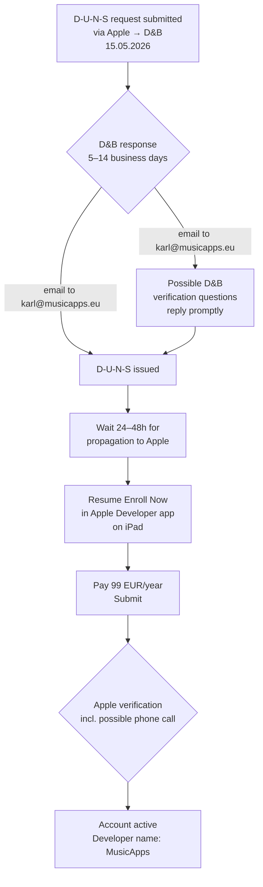

A month after the Gewerbeanmeldung, today's admin session was about kicking off the Apple Developer Organization enrollment. The actual "click through the wizard" part took maybe 20 minutes. The decisions before clicking took longer, and the result is that nothing is finished — a thing is now waiting at Dun & Bradstreet for one to two weeks, and that's the expected state.

## Question 1: which Apple ID owns the developer account?

The first non-obvious decision was **which Apple ID to register under**. I already have a personal Apple ID. The lazy path would have been to use it.

I asked Claude to argue the trade-off, and the argument against using the personal Apple ID was strong enough that I didn't need a second opinion:

- The Apple ID **permanently owns** the developer account, the apps, the certificates, and the contracts. Changing the owner Apple ID later is painful (it goes through Apple support, identity re-verification, and edge cases where it's effectively impossible).
- Mixing personal and business under one Apple ID means I can never hand any of it off cleanly — to a co-founder, a contractor, or a buyer.
- Apple's enrollment review tends to flow more smoothly when the contact email matches the legal entity's domain. Mismatches sometimes trigger extra back-and-forth during verification.

So: a new Apple ID on the company domain. Claude suggested a role-based alias rather than something tied to a person — `karl@musicapps.eu` would technically work, but it's still my name, and "person leaves, account stranded" is exactly the failure mode I want to avoid. Settled on **`appstore@musicapps.eu`**: created the alias, set it to forward into my main inbox, registered a fresh Apple ID against it, enabled 2FA. Apple ID done.

## Question 2: how do you actually get a D-U-N-S number in Germany?

A D-U-N-S number is a business identifier issued by Dun & Bradstreet. Apple requires it to verify that a legal entity exists before granting an Organization account. The "official" path is to apply directly at D&B's German portal — free, but they aggressively try to upsell you to paid products on the way in (DUNSFile, expedited service), and you have to be careful not to click through into one.

The thing I didn't know yesterday and learned today: **Apple has its own embedded path to request a D-U-N-S inside the enrollment flow.** When you start "Enroll Now" in the Apple Developer app and reach the D-U-N-S step, there's a "Look up your D-U-N-S Number" link that takes you to an Apple-branded D&B form. Same data, no upsells, free, and the request comes back tagged for Apple's enrollment system on the other end. That's the path I took.

A small contact-info quirk: I used `karl@musicapps.eu` as the contact email on the D&B form, even though the developer account is on `appstore@musicapps.eu`. Claude's reasoning when I asked: D-U-N-S is bound to the **legal entity** (name + address), not to an email address. Apple matches D-U-N-S to a developer account by entity name and address, not by email. The email is purely how D&B reaches me with questions. As long as I actually read both inboxes, the mismatch doesn't matter.

## What the enrollment flow looked like

Concretely, on the iPad Air 3:

1. Installed the Apple Developer app, signed in with the new appstore@ Apple ID.
2. Account tab → Enroll Now → chose **Organization**.
3. Filled in entity data (legal name **MusicApps.eu**, address, sole-proprietorship form, role of authorized signer).
4. Hit the "Look up your D-U-N-S" link → Apple-branded D&B form opened → filled in the same entity data → submitted.
5. Returned to the Apple flow. It now displays a "waiting for D-U-N-S" status; the rest of the enrollment (agreement, payment of the 99 EUR/year fee) is gated behind that.

End state: enrollment is open but paused at the D-U-N-S step. Nothing more to do in the app today.

## What happens next

Realistic timeline:

The two failure modes Claude flagged for the waiting period:

1. **Missed D&B mail.** If D&B asks a verification question and I don't reply within their window, the request can be closed and I'd have to restart. So: check `karl@musicapps.eu` (and spam) every day.
2. **Mismatched entity data.** D&B sometimes spot-checks the website to confirm the entity exists. The legal name on the D&B form, the Gewerbeanmeldung, and the Impressum on musicapps.eu all need to agree exactly. They do, but it's worth re-checking before D&B goes looking.

Once the D-U-N-S arrives, there's typically a 24–48 hour gap before Apple's system actually sees it, then the enrollment can continue. After payment, Apple sometimes calls the listed phone number during German business hours to verify authority — picking up that call is the difference between "account active in two days" and "account active in two weeks".

## How Claude helped today

Concretely:

- **Decided the Apple ID question.** Claude listed the trade-offs (ownership permanence, succession, Apple's review preferences) and proposed the role-based alias pattern. I picked the specific alias name and made the call.
- **Surfaced the in-flow D-U-N-S path.** I would otherwise have applied via D&B's German portal directly — slower, with the upsell traps. Claude knew about the embedded Apple path and recommended it.
- **Resolved the email-mismatch worry on the spot.** When I noticed mid-process that I'd used the wrong email on the D&B form, Claude explained why it doesn't matter (entity-bound, not email-bound) before I went down a "do I need to start over?" rabbit hole.
- **Updated my project notes and wrote this post.** The Obsidian project folder now has the current status of the enrollment, and this blog entry was drafted from that state — which is also why it's specific about which decisions were made when.

What only I could do: actually create the email alias, do the iPad steps, type my legal name and address into Apple's form, agree to terms.

## Cost and time so far

For the bureaucratic layer of going Organization on the App Store:

| Item                                               | Cost           | Time                  |
| -------------------------------------------------- | -------------- | --------------------- |
| Gewerbeanmeldung (April)                           | 26 EUR         | ~3h (research + form) |
| Email alias setup                                  | 0 EUR          | ~5 min                |
| New Apple ID + 2FA                                 | 0 EUR          | ~10 min               |
| Apple Developer enrollment start + D-U-N-S request | 0 EUR (so far) | ~30 min               |
| **Apple Developer fee (when D-U-N-S arrives)**     | 99 EUR/year    | —                     |

Cumulative cash outlay so far: 26 EUR. Cumulative bureaucratic clock time: maybe 4 hours. Most of that is up-front and doesn't recur — next year is just the Apple fee and the annual income tax return.

For now: an inbox to watch, a calendar reminder set for two weeks from today to chase if nothing has arrived by then, and back to building the iOS port tomorrow.

---

_This blog documents my attempt to build and ship a music app as a solo developer, with AI assistance. The AI does a lot of the work. I try to be specific about what._
