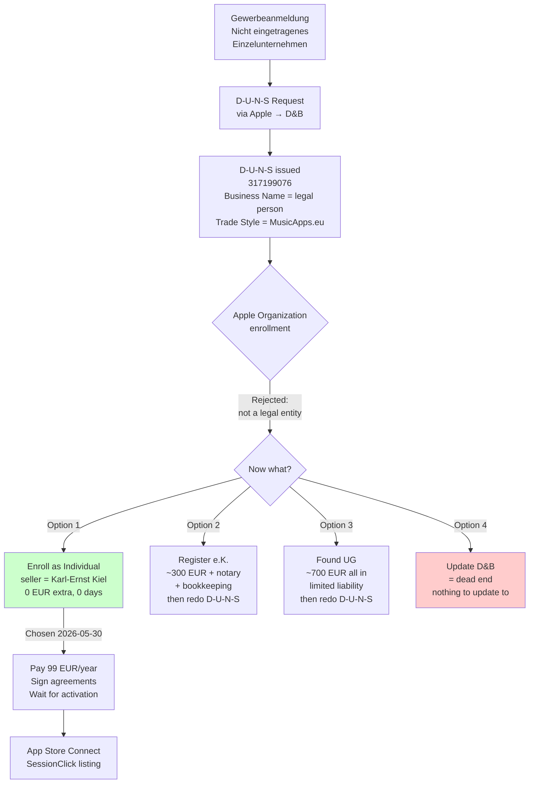

Two weeks ago I [started the Apple Developer Organization enrollment](/posts/2026-05-15-apple-developer-enrollment-and-d-u-n-s/) and was waiting on Dun & Bradstreet to issue a D-U-N-S number. I had a phone call from a D&B representative to confirm some details and one day later received the D-U-N-S number. The next step did not go as planned.

## The D-U-N-S arrived

The D&B email landed in `karl@musicapps.eu`. The record they created:

| Field          | Value                                                           |
| -------------- | --------------------------------------------------------------- |
| D-U-N-S Number | 317199076                                                       |
| Business Name  | Karl-Ernst Kiel                                                 |
| Trade Style    | MusicApps.eu                                                    |
| Address        | Holser Str. 17, 32257 Bünde                                     |
| Legal Form     | Einzelunternehmen / Non Registered Sole Proprietorship          |
| Resolution     | D-U-N-S Number created, verified through a company spokesperson |

Note the **Business Name**: my personal legal name, with "MusicApps.eu" only as the trade style. That's not a mistake on D&B's part — that's exactly what a "nicht eingetragenes Einzelunternehmen" looks like in their data model. The Gewerbe and the human are legally the same entity. I should have noticed the implication of that field before I clicked "Continue" in the Apple Developer app. I didn't.

## What Apple did with it

I opened the paused Apple Developer enrollment on the iPad, typed "MusicApps.eu" as the legal entity name and "317199076" as the D-U-N-S, and submitted. Apple immediately came back with:

> _This organization could not be verified as a legal entity. If you are a sole proprietorship/single person company, enroll as an individual. If this organization should be listed as a legal entity, update your D&B profile._

Two suggestions, neither obviously right: enroll as Individual (then what was the D-U-N-S for?), or update the D&B profile (in which direction?). I screenshotted the error and asked Claude.

## Why Apple rejected it

Claude's diagnosis was immediate and, after a minute of thinking, obvious:

Apple's Organization enrollment requires an entity with **separate legal personality**. In Germany that means an entry in the Handelsregister: GmbH, UG (haftungsbeschränkt), AG, OHG, KG, or e.K. (eingetragener Kaufmann). A plain Gewerbeanmeldung does _not_ create a separate legal entity — under German law, an Einzelunternehmer and his Gewerbe are the same person. The Gewerbe is a tax/regulatory wrapper, not a legal entity.

D&B classified me correctly: "Non Registered Sole Proprietorship." Apple read that classification, applied its rule, and refused the Organization path. Both systems are working as designed; my plan was the bug.

"Update your D&B profile" is therefore a dead end. There is nothing to update _to_ — without a Handelsregister entry, there is no separate entity to put on the form. D&B wouldn't change the classification even if I asked, because it's accurate.

## The options Claude laid out

Claude framed it as four paths, in increasing order of effort:

1. **Enroll as Individual now.** App Store seller name becomes my personal legal name, not "MusicApps.eu." The D-U-N-S is still recorded by Apple and remains useful if I ever upgrade. Fastest path to shipping SessionClick.
2. **Register an e.K.** in the Handelsregister: ~€200–400 plus notary, ongoing bookkeeping obligations. Then redo the D-U-N-S with the HR number and reattempt as Organization. "MusicApps.eu e.K." would appear as seller. Cleanest brand result for a solo founder.
3. **Found a UG (haftungsbeschränkt)** — mini-GmbH, €1 minimum capital but realistically €500–1000 with notary and registration. Limited liability. The "proper" path if growth is the bet.
4. **Update D&B** — don't bother, won't help.

Claude recommended option 1 given where I am: SessionClick iOS is well into Phase 5, the goal this quarter is to ship, and the bureaucratic upgrade can happen later if MusicApps.eu actually grows into something that needs it. The recommendation matched my own instinct — I agreed without further debate.

## What I lose by going Individual

Being honest about it:

- The App Store listing will show **Karl-Ernst Kiel** as the seller, not "MusicApps.eu." For a music-tools brand that wants to look like a small company rather than a hobby, this is the real cost.
- Apple has been tightening the "public developer name" field for Individual accounts. Historically you could set a brandable name like "MusicApps"; recently they have more often forced it to the legal name. Whether "MusicApps.eu" sticks as the public name is something I'll find out at the next screen.
- No limited liability. As an Einzelunternehmer I'm personally liable for the app anyway, so this doesn't change versus today — but it does mean the Organization path was never going to give me liability protection either. Only a UG/GmbH does.

## What I keep

- The D-U-N-S is not wasted. Apple stores it on the account and it carries over if I ever upgrade to Organization. The 10-day wait was not pure overhead.
- The Gewerbeanmeldung is also not wasted: it's still required for the income to be a legitimate business income, for the Kleinunternehmerregelung, for the Impressum, for invoicing. None of that goes away because Apple's classification differs.
- The `appstore@musicapps.eu` Apple ID stays correct as the account owner — see [the earlier post](/posts/2026-05-15-apple-developer-enrollment-and-d-u-n-s/) for why a company-domain alias is still the right choice even on an Individual account.

## The actual decision path

## How Claude helped

Concretely on this one:

- **Diagnosed the error in one shot.** Without Claude I would have spent the afternoon reading German indie-dev forum threads to figure out whether this was a D&B problem or an Apple problem. Claude knew immediately that Apple's "legal entity" definition specifically excludes nicht eingetragene Einzelunternehmen, and that the D&B record was correct rather than fixable.
- **Killed the "update D&B" path** before I wasted time on it. The error message presented it as a real option; it isn't.
- **Laid out the four alternatives with realistic costs** — the e.K. and UG numbers are roughly right and let me dismiss them quickly given the goal of shipping this quarter.
- **Recommended Individual** with a one-line argument about momentum I happened to agree with. I was already leaning that way, but having Claude make the call explicitly is what got me to stop deliberating and click the button.
- **Updated the project memory and wrote this post** from the decision context, including the bits I didn't ask it to surface (like "D-U-N-S still records to the account, not wasted").

What only I could do: read the actual error on the iPad, decide whether shipping speed or brand-on-storefront mattered more right now (speed), and accept that the App Store listing will say my personal name for a while.

## Where I am at end of day

Enrollment switched to Individual, currently moving through the rest of the wizard (legal agreement and the 99 EUR/year fee). Activation should take 24–48 hours plus the chance of a verification phone call during German business hours.

The brand cost — my legal name on the storefront instead of "MusicApps.eu" — is the kind of thing that mattered a lot in my head before today and matters less now that the alternative is "delay the launch by weeks and spend €300+ to register an e.K." If MusicApps grows into something with real revenue, registering an e.K. and migrating becomes worth it. Until then, the seller-name field is a vanity expense.

Back to iOS tomorrow.

---

_This blog documents my attempt to build and ship a music app as a solo developer, with AI assistance. The AI does a lot of the work. I try to be specific about what._
