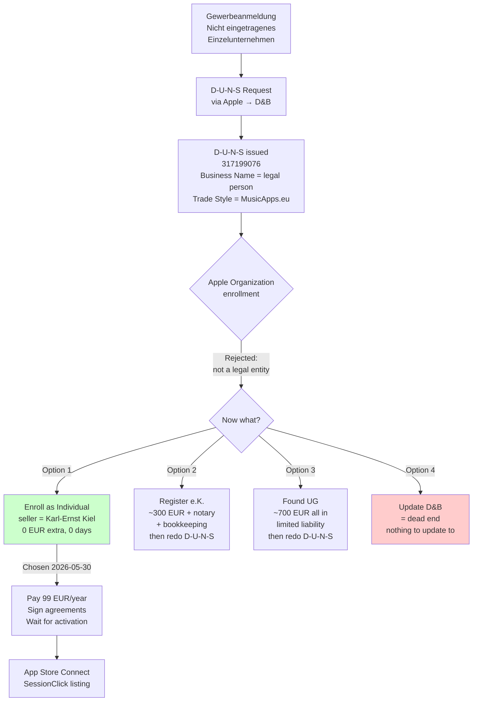
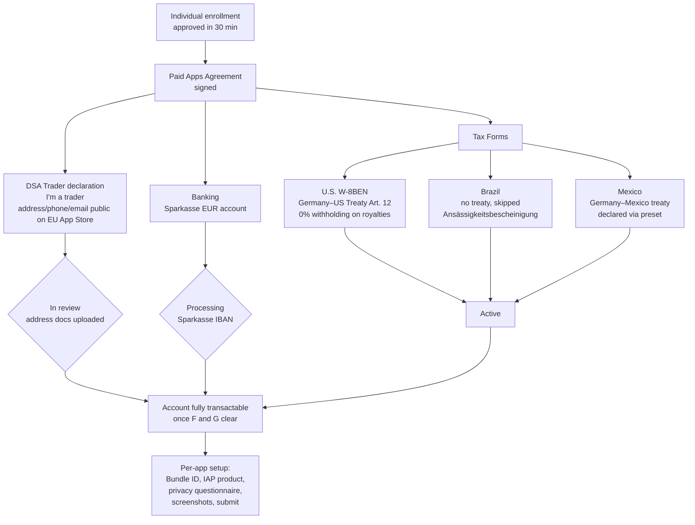

Two weeks ago I [started the Apple Developer Organization enrollment](/posts/2026-05-15-apple-developer-enrollment-and-d-u-n-s/) and was waiting on Dun & Bradstreet to issue a D-U-N-S number. I had a phone call from a D&B representative to confirm some details and one day later received the D-U-N-S number. The next step did not go as planned.

## The D-U-N-S arrived

The D&B email landed in `karl@musicapps.eu`. The record they created:

| Field          | Value                                                           |
| -------------- | --------------------------------------------------------------- |
| D-U-N-S Number | 317199076                                                       |
| Business Name  | Karl-Ernst Kiel                                                 |
| Trade Style    | MusicApps.eu                                                    |
| Address        | Holser Str. 17, 32257 Bünde                                     |
| Legal Form     | Einzelunternehmen / Non Registered Sole Proprietorship          |
| Resolution     | D-U-N-S Number created, verified through a company spokesperson |

Note the **Business Name**: my personal legal name, with "MusicApps.eu" only as the trade style. That's not a mistake on D&B's part — that's exactly what a "nicht eingetragenes Einzelunternehmen" looks like in their data model. The Gewerbe and the human are legally the same entity. I should have noticed the implication of that field before I clicked "Continue" in the Apple Developer app. I didn't.

## What Apple did with it

I opened the paused Apple Developer enrollment on the iPad, typed "MusicApps.eu" as the legal entity name and "317199076" as the D-U-N-S, and submitted. Apple immediately came back with:

> _This organization could not be verified as a legal entity. If you are a sole proprietorship/single person company, enroll as an individual. If this organization should be listed as a legal entity, update your D&B profile._

Two suggestions, neither obviously right: enroll as Individual (then what was the D-U-N-S for?), or update the D&B profile (in which direction?). I screenshotted the error and asked Claude.

## Why Apple rejected it

Claude's diagnosis was immediate and, after a minute of thinking, obvious:

Apple's Organization enrollment requires an entity with **separate legal personality**. In Germany that means an entry in the Handelsregister: GmbH, UG (haftungsbeschränkt), AG, OHG, KG, or e.K. (eingetragener Kaufmann). A plain Gewerbeanmeldung does _not_ create a separate legal entity — under German law, an Einzelunternehmer and his Gewerbe are the same person. The Gewerbe is a tax/regulatory wrapper, not a legal entity.

D&B classified me correctly: "Non Registered Sole Proprietorship." Apple read that classification, applied its rule, and refused the Organization path. Both systems are working as designed; my plan was the bug.

"Update your D&B profile" is therefore a dead end. There is nothing to update _to_ — without a Handelsregister entry, there is no separate entity to put on the form. D&B wouldn't change the classification even if I asked, because it's accurate.

## The options Claude laid out

Claude framed it as four paths, in increasing order of effort:

1. **Enroll as Individual now.** App Store seller name becomes my personal legal name, not "MusicApps.eu." The D-U-N-S is still recorded by Apple and remains useful if I ever upgrade. Fastest path to shipping SessionClick.
2. **Register an e.K.** in the Handelsregister: ~€200–400 plus notary, ongoing bookkeeping obligations. Then redo the D-U-N-S with the HR number and reattempt as Organization. "MusicApps.eu e.K." would appear as seller. Cleanest brand result for a solo founder.
3. **Found a UG (haftungsbeschränkt)** — mini-GmbH, €1 minimum capital but realistically €500–1000 with notary and registration. Limited liability. The "proper" path if growth is the bet.
4. **Update D&B** — don't bother, won't help.

Claude recommended option 1 given where I am: SessionClick iOS is well into Phase 5, the goal this quarter is to ship, and the bureaucratic upgrade can happen later if MusicApps.eu actually grows into something that needs it. The recommendation matched my own instinct — I agreed without further debate.

## What I lose by going Individual

Being honest about it:

- The App Store listing will show **Karl-Ernst Kiel** as the seller, not "MusicApps.eu." For a music-tools brand that wants to look like a small company rather than a hobby, this is the real cost.
- Apple has been tightening the "public developer name" field for Individual accounts. Historically you could set a brandable name like "MusicApps"; recently they have more often forced it to the legal name. Whether "MusicApps.eu" sticks as the public name is something I'll find out at the next screen.
- No limited liability. As an Einzelunternehmer I'm personally liable for the app anyway, so this doesn't change versus today — but it does mean the Organization path was never going to give me liability protection either. Only a UG/GmbH does.

## What I keep

- The D-U-N-S is not wasted. Apple stores it on the account and it carries over if I ever upgrade to Organization. The 10-day wait was not pure overhead.
- The Gewerbeanmeldung is also not wasted: it's still required for the income to be a legitimate business income, for the Kleinunternehmerregelung, for the Impressum, for invoicing. None of that goes away because Apple's classification differs.
- The `appstore@musicapps.eu` Apple ID stays correct as the account owner — see [the earlier post](/posts/2026-05-15-apple-developer-enrollment-and-d-u-n-s/) for why a company-domain alias is still the right choice even on an Individual account.

## The actual decision path

## How Claude helped

Concretely on this one:

- **Diagnosed the error in one shot.** Without Claude I would have spent the afternoon reading German indie-dev forum threads to figure out whether this was a D&B problem or an Apple problem. Claude knew immediately that Apple's "legal entity" definition specifically excludes nicht eingetragene Einzelunternehmen, and that the D&B record was correct rather than fixable.
- **Killed the "update D&B" path** before I wasted time on it. The error message presented it as a real option; it isn't.
- **Laid out the four alternatives with realistic costs** — the e.K. and UG numbers are roughly right and let me dismiss them quickly given the goal of shipping this quarter.
- **Recommended Individual** with a one-line argument about momentum I happened to agree with. I was already leaning that way, but having Claude make the call explicitly is what got me to stop deliberating and click the button.
- **Updated the project memory and wrote this post** from the decision context, including the bits I didn't ask it to surface (like "D-U-N-S still records to the account, not wasted").

What only I could do: read the actual error on the iPad, decide whether shipping speed or brand-on-storefront mattered more right now (speed), and accept that the App Store listing will say my personal name for a while.

## Where I am at end of day

Enrollment switched to Individual, currently moving through the rest of the wizard (legal agreement and the 99 EUR/year fee). Activation should take 24–48 hours plus the chance of a verification phone call during German business hours.

The brand cost — my legal name on the storefront instead of "MusicApps.eu" — is the kind of thing that mattered a lot in my head before today and matters less now that the alternative is "delay the launch by weeks and spend €300+ to register an e.K." If MusicApps grows into something with real revenue, registering an e.K. and migrating becomes worth it. Until then, the seller-name field is a vanity expense.

Back to iOS tomorrow.

## Approved 30 minutes later — and then the next checklist appeared

I expected the Individual enrollment to take a day or two, possibly with a verification phone call. Instead the approval email landed **30 minutes after submission**. Faster than the Gewerbeanmeldung, faster than the D-U-N-S, faster than I'd planned for. Suddenly I had an active developer account and an App Store Connect dashboard staring at me with a long list of "incomplete" sections.

Because I want to sell SessionClick's freemium unlock as an in-app purchase, I can't just stop at the developer enrollment — I need a **Paid Apps Agreement** active, and that pulls in a chain of dependencies: DSA trader declaration, banking, U.S. tax form, and a fresh per-country tax form for every storefront with local withholding rules. Most of the rest of the day went to those.

## DSA: am I a trader?

The first non-obvious gate was the **Digital Services Act trader declaration**. The EU now requires Apple to display verified contact details for any "trader" selling apps to EU consumers, and Apple asks you up front to self-classify.

Claude's reading was unambiguous: a "trader" under DSA is anyone acting in the course of a trade, business, craft, or profession — no Kleinunternehmer exception, no hobby threshold. I have a Gewerbeanmeldung, I'm enabling IAP, I have an Impressum on musicapps.eu. By every signal Apple cross-checks, I'm a trader. Choosing "non-trader" would be a false declaration, and Apple has been removing apps from EU storefronts since early 2025 when accounts claim non-trader status while showing commercial signals.

So I declared **trader** and entered the contact info that will appear publicly on the EU App Store product page: same address as the Gewerbe and Impressum, `karl@musicapps.eu` for the email, and my phone number. Apple then asked me to upload **address verification documents** (Gewerbeanmeldung + a utility bill matching the address). That submission is now in review.

The "phone number on every EU product page forever" part stings a bit. A separate VoIP/business number would have been the smarter move — Claude flagged it, I noted it for the next iteration, and used the personal number for now to avoid a multi-day Sipgate signup blocking the rest of today's work.

## Banking: a Sparkasse account, and the boring choice paying off

Added a Sparkasse EUR account. Apple stores IBAN + BIC, matches the account holder name to the legal entity (Karl-Ernst Kiel), and confirms it'll send monthly payouts once the €10 minimum threshold is reached.

Claude's prep had specifically warned that Wise / N26-style fintechs sometimes cause Apple verification issues for the developer payout slot and recommended a "boring German Hausbank" — which is what I had anyway. No drama, no micro-deposits, no callback. Status is now **processing**; it'll flip to verified in a few days.

## The U.S. tax form: where the morning slowed down

The W-8BEN was the fiddliest single document of the day. Apple presents it as an interactive questionnaire that builds the actual IRS form behind the scenes, then asks you to sign the generated PDF as a separate step ("Certificate of Foreign Status of Beneficial Owner"). Several places it could go wrong:

1. **"Are you a U.S. tax resident?"** — No. Straightforward, but routes you to W-8BEN (individual) vs W-9 (U.S. person). Pick wrong and the form is wrong.
2. **U.S. TIN vs Foreign TIN vs Reference Number** — three fields on Part I that look interchangeable but aren't. The U.S. TIN line offered a Form SS-4 download for getting an EIN; Claude was firm that as a German indie selling on the App Store I do **not** need an EIN, that field stays blank, and the Foreign TIN is where my **German Steuer-ID** (the 11-digit personal one, not the Steuernummer, not the VAT ID) goes. This was the single most useful clarification of the day — getting it wrong would have been weeks of correspondence to fix.
3. **Treaty article** — Part II asks which article of which treaty justifies the reduced withholding rate. Apple's UI offered a preset called **"Income from the sale of applications"** which auto-encodes Article 12 of the Germany–US treaty and the 0% rate. Without that preset I would have been typing "Article 12, Paragraph 1, 0%, Royalties" into three blanks and praying I got the wording right. With it: one click.
4. **"Title" field on the signature page** — meaningless for an individual (it's a leftover from the entity version of the form). Claude said to type **"Owner"**, the universally-accepted answer. I'd have spent ten minutes second-guessing this one without input.
5. **Typed-name signature** — must match Line 1 exactly, including the hyphen in "Karl-Ernst". One typo and it gets rejected and you redo the form.

Outcome: U.S. tax form **Active**, 0% withholding on U.S. App Store payouts. The Germany–U.S. treaty is genuinely indie-friendly here — without the W-8BEN this would be a flat 30% withholding on every U.S. sale forever, recoverable only via the U.S. IRS refund process, which is exactly as fun as it sounds.

## Brazil and Mexico: paperwork with a twist

After the U.S. form, Apple surfaced declarations for **Brazil** and **Mexico**. Both follow the same shape as the W-8BEN — declare German tax residency, no permanent establishment in-country, Steuer-ID as the foreign TIN, sign — but each has its own wrinkle.

**Brazil** asks for a **Tax Residency Certificate** (Ansässigkeitsbescheinigung) issued by the local Finanzamt. Optional, not a hard blocker — but without it, Brazilian withholding on royalties to a non-treaty country runs higher (Germany–Brazil currently has **no active income tax treaty**; the old one was terminated in 2005 and never replaced). Claude's recommendation, which I agreed with: skip the certificate for now. Brazilian App Store revenue for a niche metronome will be tiny for a long time; the few extra percent of withholding on €5/month is not worth the 1–3 week Finanzamt round-trip. If Brazil ever becomes a meaningful storefront, I'll apply for the certificate then and re-upload — Apple lets you update tax docs anytime.

**Mexico** was simpler — Germany–Mexico **does** have an active treaty (in force since 2009) capping software royalty withholding at 10%. Apple's form had a preset analogous to the U.S. "Income from the sale of applications" path; I picked it, submitted, done.

## The recovery-contact gotcha

A small but worth-recording detour: I set up my personal Apple ID as the **account recovery contact** for the new `appstore@musicapps.eu` Apple ID. The personal Apple ID got a notification asking to accept. I replied "OK" to the notification — which did nothing, because the notification isn't interactive. The accept button lives in **Settings → [your name] → Sign-In & Security → Account Recovery** on the device signed into the personal Apple ID. Tap, accept, done.

Mildly embarrassing because it cost ten minutes of "why is this still showing as not accepted?", but worth flagging because Apple's UX here is genuinely confusing — a notification that looks like a prompt but is only a status alert.

## Sandbox testers

Final account-level item: created three **sandbox testers** in App Store Connect. These are fake Apple IDs that only exist in Apple's sandbox StoreKit environment, used to test the IAP flow without spending real money. Three regions for storefront-pricing and locale testing:

| Tester                  | Storefront    | For                           |
| ----------------------- | ------------- | ----------------------------- |
| sandbox-de@musicapps.eu | Germany       | Primary EUR testing           |
| sandbox-us@musicapps.eu | United States | USD, English locale           |
| sandbox-jp@musicapps.eu | Japan         | JPY, Japanese locale fallback |

The email addresses are real aliases on musicapps.eu but only used as identifiers — Apple never sends verification mail to them. The "must be unique across all Apple IDs ever" rule is the only real constraint; the alias domain makes it trivial.

Used the same simple password across all three. Claude's note: low practical risk (sandbox testers can't make real purchases or access anything), but Apple sometimes forces a password reset on first sign-in and sometimes pushes 2FA into the sandbox flow, in which case codes go to the alias inbox — so the aliases should forward somewhere I actually read. They do.

## What's left, what's open

End-of-day status:

| Item                                                         | Status                                                |
| ------------------------------------------------------------ | ----------------------------------------------------- |
| Developer enrollment (Individual)                            | ✅ Active                                             |
| Paid Apps Agreement signed                                   | ✅                                                    |
| DSA trader declaration submitted                             | ⏳ In review (address docs uploaded)                  |
| Banking (Sparkasse)                                          | ⏳ Processing                                         |
| U.S. tax form (W-8BEN)                                       | ✅ Active                                             |
| Brazil tax declaration                                       | ✅ (without residency certificate)                    |
| Mexico tax declaration                                       | ✅                                                    |
| Account recovery contact                                     | ✅ Active                                             |
| Sandbox testers (3)                                          | ✅ Created                                            |
| Per-app setup (Bundle ID, IAP product, privacy, screenshots) | ⏳ Phase 2, starts once iOS Xcode build is functional |

Nothing left to _do_ on the account side — both pending items resolve themselves. From here, the remaining work is per-app, in parallel with the iOS port.

## How Claude helped (Part II)

The bureaucratic afternoon, specifically:

- **DSA trader classification.** Removed the ambiguity in one sentence: Gewerbe + IAP + Impressum = trader, full stop, with the specific enforcement consequence (EU removals for false declarations since early 2025) to make the choice obvious.
- **Bank choice guard-rail.** "Don't use Wise/N26 in the developer-payout slot, boring Hausbank is the right call here" — would have learned this the hard way otherwise.
- **W-8BEN navigation.** The four moments where I genuinely could have submitted something wrong without Claude in the loop: TIN-vs-EIN, Foreign TIN = Steuer-ID specifically, treaty preset selection, and the meaningless "Title" field. None of those are obvious from the form itself; all of them are the kind of detail that German indie-dev forum threads litigate for paragraphs at a time.
- **Brazil / Mexico framing.** Cleanly separated "Brazil = no treaty, accept higher withholding" from "Mexico = treaty exists, use the preset", which let me clear both in five minutes instead of researching each country's rules.
- **Recovery-contact diagnosis.** Identified that the "reply OK" notification wasn't interactive and pointed at the right Settings path, instead of letting me retry the invite flow.
- **Sandbox tester design.** Suggested the three-region pattern (DE/US/JP) and the unique-email constraint up front, so I created what I'll actually need rather than one tester I'd have to extend later.
- **Updated project memory and rewrote this post** to cover the afternoon's events with the same level of specificity as the morning's D-U-N-S/Individual decision.

What only I could do: physically submit each form on Apple's UI, type my legal name and address into a dozen near-identical fields without losing concentration, decide which tradeoffs (public phone number, skip-Brazil-certificate, shared sandbox password) were acceptable for the goal of shipping this quarter, and accept the recovery contact from the right device.

## Cost update

Updated cumulative-cost table for the bureaucratic layer:

| Item                                            | Cost            | Time    |
| ----------------------------------------------- | --------------- | ------- |
| Gewerbeanmeldung (April)                        | 26 EUR          | ~3h     |
| Email alias setup                               | 0 EUR           | ~5 min  |
| New Apple ID + 2FA                              | 0 EUR           | ~10 min |
| D-U-N-S request (Apple → D&B path)              | 0 EUR           | ~30 min |
| Apple Developer Individual enrollment           | **99 EUR/year** | ~10 min |
| Paid Apps Agreement + DSA + Banking + tax forms | 0 EUR           | ~3h     |
| **Total cash outlay so far**                    | **125 EUR**     | **~7h** |

The 7 hours of bureaucratic clock time is the up-front cost of operating legally in the App Store from Germany as a one-person business. Next year, all that's left is the 99 EUR renewal and the annual income-tax return. Worth it.

Tomorrow: back to iOS code, and the per-app setup starts as soon as the Xcode project is producing a TestFlight-able build.

---

_This blog documents my attempt to build and ship a music app as a solo developer, with AI assistance. The AI does a lot of the work. I try to be specific about what._
